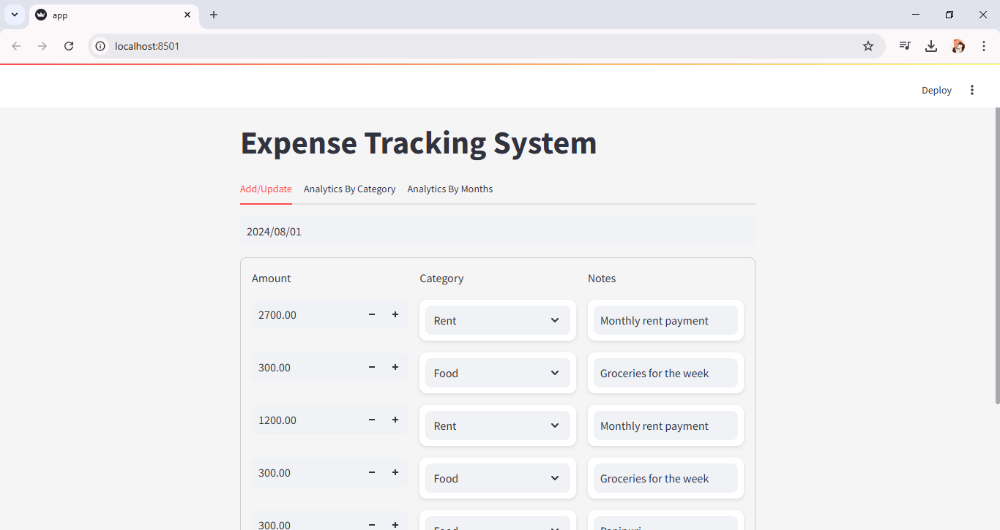
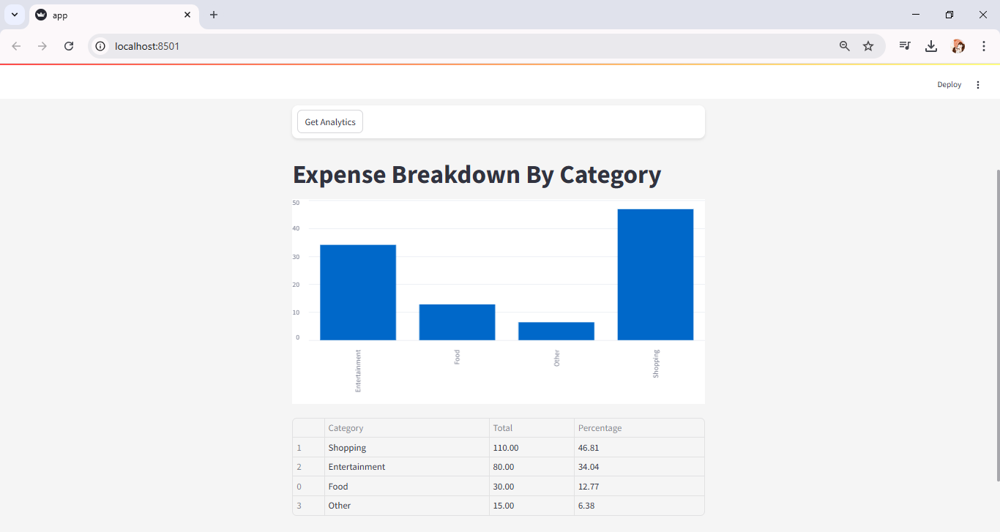
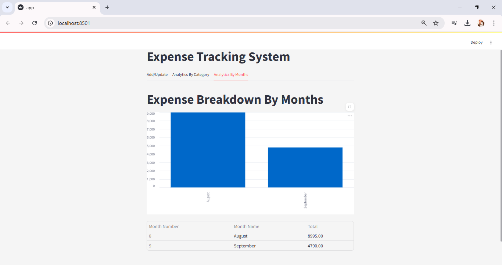

# Expense Management System

The Expense Tracking System is a software solution developed to streamline and simplify the process of expense management for individuals and businesses. This project aims to provide users with an efficient and organized approach to expense management, improving accuracy and offering valuable insights into expenditure patterns.


## 🎯Project Structure

- **frontend/**: Contains the Streamlit application code.
- **backend/**: Contains the FastAPI backend server code.
- **tests/**: Contains the test cases for both frontend and backend.
- **requirements.txt**: Lists the required Python packages.
- **README.md**: Provides an overview and instructions for the project.


## 💡Features

- Add expenses with detailed descriptions and amounts
- Automatically capture the date and time of each expense
- Display all expenses
- Calculate total expenses incurred
- User-friendly interface
- Data visualization for expense analysis


## 🚀Usage

 **Launch the Application:**  
   - Start the server and access the web interface at:  
     ```
     http://localhost:8000
     ```
### 🔥 **Add / Update Tab :**
- **Date Picker:** Select the date for the expense entry.  
- **Amount Field:**  
    - Enter the amount spent.  
    - Use the `+` and `-` buttons to adjust the value.  
- **Category Selection:**  
    - Choose from predefined categories (e.g., Rent, Food, etc.).  
- **Notes Section:**  
    - Add custom notes describing the expense.  
- **Submit Button:**  
    - Save the expense record to the database.

   

### 📊 Analytics By Category Tab :

The **Analytics By Category Tab** provides a visual breakdown of expenses by category. Users can select a **Start Date** and **End Date** to filter the expenses within a specific time range. 

#### 🔥 **Features:**
- **Date Range Filter:** Select start and end dates to view expenses for a custom period.  
- **Bar Chart Visualization:**  
    - Displays expenses by category.  
    - Makes it easy to identify major spending areas.  
- **Summary Table:**  
    - Lists categories along with total expenses and their percentage contribution. 

   

### 📊 Analytics By Months Tab :

The **Analytics By Months Tab** provides a monthly breakdown of expenses, helping users visualize their spending patterns over time.

#### 🔥 **Features:**
- **Monthly Bar Chart:**  
    - Displays total expenses for each month.  
    - Allows users to compare monthly spending visually.  
- **Summary Table:**  
    - Shows month number, month name, and total expenses.  
    - Helps users quickly review their spending across different months.

   


## 🛠️Setup Instructions

1. **Clone the repository**:
   ```bash
   git clone https://github.com/sid-7878/expense-management-system.git
   cd expense-management-system
   ```
2. **Install dependencies:**:   
   ```commandline
    pip install -r requirements.txt
   ```
3. **Run the FastAPI server:**:   
   ```commandline
    uvicorn server.server:app --reload
   ```
4. **Run the Streamlit app:**:   
   ```commandline
    streamlit run frontend/app.py
   ```


